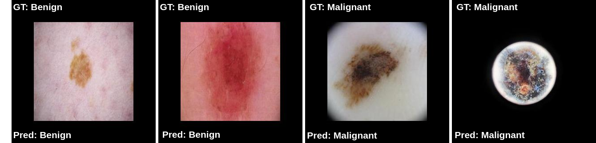
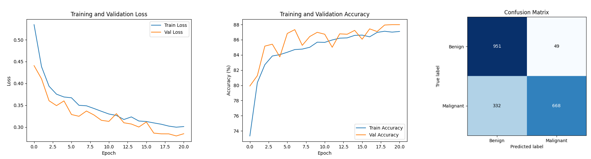
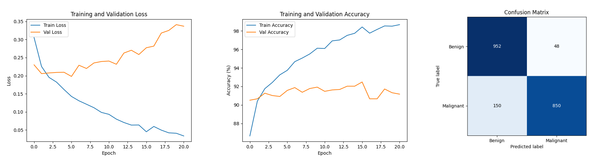
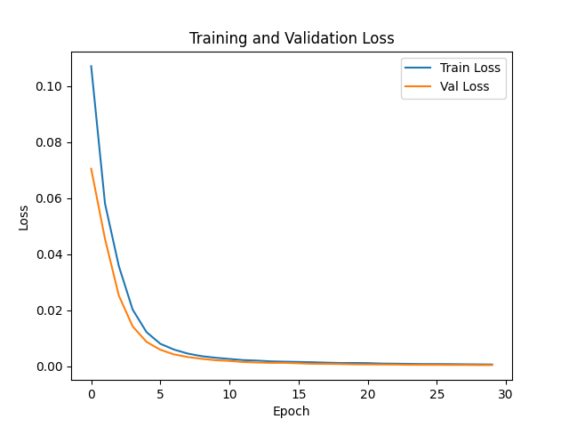
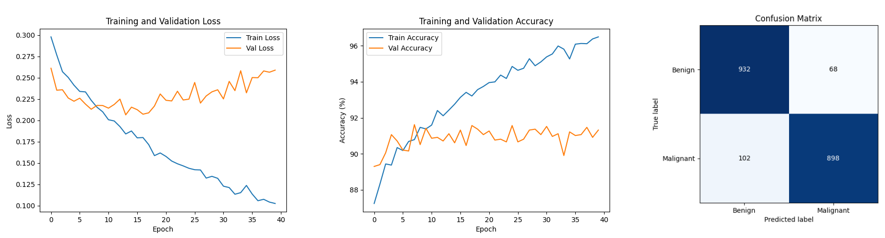

# skincancer_classification

</div>
</figure>
<figure>
<div align="center">

<figcaption>
    <div>
        Classification Results
    </div>
</figcaption>
</div>

## Quick Links

- [Installation](#installation)
- [Usage](#usage)
  - [Training](#training)
    - [Baseline CNN](#baseline-cnn)
    - [MobileNetV2](#mobilenetv2)
    - [Custom Encoder + Classifier](#custom-encoder--classifier)
  - [Results](#results)
    - [Baseline CNN Results](#baseline-cnn-results)
    - [MobileNetV2 Results](#mobilenetv2-results)
    - [Custom Encoder + Classifier Results](#custom-encoder--classifier-results)
  - [Inference](#inference)
---

## Installation

### Setup Instructions

1. Clone the repository:
   ```bash
   git clone https://github.com/hrishikesh-st/skincancer_classification.git
   cd skincancer_classification
   ```

2. Create and activate a new Conda environment:
   ```bash
   conda create --name skincancer_env python=3.8 -y
   conda activate skincancer_env
   ```

3. Install dependencies:
   ```bash
   pip install -r requirements.txt

---

## Usage

### Training

Three models were trained:
1. Baseline CNN
2. MobileNetV2
3. Custom Encoder + Classifier

#### Baseline CNN

Train the baseline CNN model:
```bash
usage: baseline_MNetV2_train.py [-h] [--base_dir BASE_DIR] [--epochs EPOCHS] [--batch_size BATCH_SIZE] [--lr LR] [--lr_decay LR_DECAY] [--val_split VAL_SPLIT] [--seed SEED] [--device DEVICE] [--model_name {baseline,mobilenetv2}] [--freeze_backbone]

Train a Skin Cancer Classifier with Val Split

options:
  -h, --help            show this help message and exit
  --base_dir BASE_DIR
  --epochs EPOCHS
  --batch_size BATCH_SIZE
  --lr LR
  --lr_decay LR_DECAY
  --val_split VAL_SPLIT
                        Fraction of training data used for validation
  --seed SEED           Random seed for splitting
  --device DEVICE       Choose device: cuda or cpu
  --model_name {baseline,mobilenetv2}
                        Select which model architecture to train
  --freeze_backbone     Freeze the feature extraction layers in MobileNetV2
```

Example:
```bash
python baseline_MNetV2_train.py --base_dir data --epochs 21 --batch_size 64 --lr 1e-4 --val_split 0.2 --model_name baseline --device cuda
```

#### MobileNetV2

Train the MobileNetV2 model:
```bash
usage: baseline_MNetV2_train.py [-h] [--base_dir BASE_DIR] [--epochs EPOCHS] [--batch_size BATCH_SIZE] [--lr LR] [--lr_decay LR_DECAY] [--val_split VAL_SPLIT] [--seed SEED] [--device DEVICE] [--model_name {baseline,mobilenetv2}] [--freeze_backbone]

Train a Skin Cancer Classifier with Val Split

options:
  -h, --help            show this help message and exit
  --base_dir BASE_DIR
  --epochs EPOCHS
  --batch_size BATCH_SIZE
  --lr LR
  --lr_decay LR_DECAY
  --val_split VAL_SPLIT
                        Fraction of training data used for validation
  --seed SEED           Random seed for splitting
  --device DEVICE       Choose device: cuda or cpu
  --model_name {baseline,mobilenetv2}
                        Select which model architecture to train
  --freeze_backbone     Freeze the feature extraction layers in MobileNetV2
```

Example:
```bash
python baseline_MNetV2_train.py --base_dir data --epochs 21 --batch_size 64 --lr 1e-4 --val_split 0.2 --model_name mobilenetv2 --device cuda
```

#### Custom Encoder + Classifier

First train the autoencoder:
```bash
usage: autoencoder_train.py [-h] [--data_dir DATA_DIR] [--epochs EPOCHS] [--batch_size BATCH_SIZE] [--lr LR] [--device {cuda,cpu}]

Train a U-Net MobileNet Autoencoder

options:
  -h, --help            show this help message and exit
  --data_dir DATA_DIR   Path to dataset root directory
  --epochs EPOCHS       Number of training epochs
  --batch_size BATCH_SIZE
                        Batch size for training
  --lr LR               Learning rate
  --device {cuda,cpu}   Device to use
```

Example:
```bash
python autoencoder_train.py --data_dir data --epochs 30 --batch_size 64 --lr 1e-4 --device cuda
```

Then train the custom encoder + classifier:
```bash
usage: encoder_classifier_train.py [-h] [--base_dir BASE_DIR] [--epochs1 EPOCHS1] [--epochs2 EPOCHS2] [--batch_size BATCH_SIZE] [--lr1 LR1] [--lr2 LR2] [--lr_decay LR_DECAY] [--val_split VAL_SPLIT] [--seed SEED] [--device DEVICE] [--model_name MODEL_NAME]

Train a Skin Cancer Classifier with Val Split

options:
  -h, --help            show this help message and exit
  --base_dir BASE_DIR
  --epochs1 EPOCHS1
  --epochs2 EPOCHS2
  --batch_size BATCH_SIZE
  --lr1 LR1
  --lr2 LR2
  --lr_decay LR_DECAY
  --val_split VAL_SPLIT
                        Fraction of training data used for validation
  --seed SEED           Random seed for splitting
  --device DEVICE       Choose device: cuda or cpu
  --model_name MODEL_NAME
```

Example:
```bash
python ensemble_train_final.py --base_dir data --epochs1 25 --epochs2 40 --batch_size 64 --lr1 1e-3 --lr2 5e-5 --lr_decay 0.9 --val_split 0.2 --lr_decay 0.75 --model_name encoder_classifier --device cuda
```

### Results

The classification results for the three models on the TestSet are as follows:

| Metric                      | Baseline CNN | MobileNetV2 | Custom Encoder + Classifier |
|-----------------------------|-------------|-------------|-----------------------------|
| Accuracy                    | 80.95 %     | 90.10 %     | 91.50 %                     |
| Precision                   | 0.9317      | 0.9465      | 0.9296                      |
| Recall                      | 0.6680      | 0.8500      | 0.8980                      |
| F1 Score                    | 0.7781      | 0.8957      | 0.9135                      |
 
#### Baseline CNN Results
<figure>
    <div align="center">
        
        <figcaption>
            <div>
                Baseline CNN Results
            </div>
        </figcaption>
    </div>
</figure>


#### MobileNetV2 Results
<figure>
    <div align="center">
        
        <figcaption>
            <div>
                MobileNetV2 Results
            </div>
        </figcaption>
    </div>
</figure>


#### Custom Encoder + Classifier Results

##### Encoder Results
<figure>
    <div align="left">
        
        <figcaption>
            <div>
                Custom Encoder Results
            </div>
        </figcaption>
    </div>
</figure>

##### Classifier Results
<figure>
    <div align="center">
        
        <figcaption>
            <div>
                Custom Encoder + Classifier Results
            </div>
        </figcaption>
    </div>
</figure>

### Inference

To run inference on a single image:
```bash
usage: infer.py [-h] --test_dir TEST_DIR --model_path MODEL_PATH --output_dir OUTPUT_DIR [--device {cuda,cpu}] --model_name {baseline,mobilenetv2,encoder_classifier}

Run inference on a folder of test images

options:
  -h, --help            show this help message and exit
  --test_dir TEST_DIR   Path to test dataset directory
  --model_path MODEL_PATH
                        Path to trained model (.pth)
  --output_dir OUTPUT_DIR
                        Path to save annotated images
  --device {cuda,cpu}   Device to use for inference
  --model_name {baseline,mobilenetv2,encoder_classifier}
                        Select the model architecture
```

Example:
```bash
python infer.py --test_dir data/TestSet --model_path models/baseline.pth --output_dir results --device cuda --model_name baseline
```
